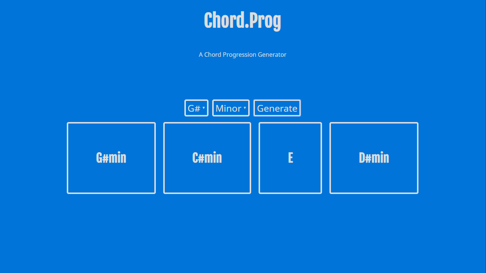

### chord.prog

*A chord progression generator. See it in action [here.](https://gauraklein.github.io/chord.prog/)*

In my free time I like to play music and I find myself using similar chord progression tools pretty regularly. I created this project to test myself and see if I could recreate a functional app. Through this project I was able to sucessfully reverse engineer the base functionality of an app that I use regularly as well as solve a real world issue through code. There is a lot of room for expansion with this application and it really opened my eyes to what is possible within the world of development.

## Technologies Used
- Javascript
- SCSS
- HTML
